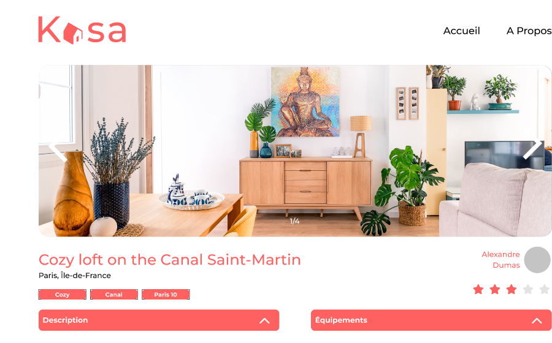

## mon objectif :

Démarrer le projet React et développer l’ensemble de l’application, les composants React, les routes React Router, en suivant les maquettes Figma (responsives !)

## lien Figma:
https://www.figma.com/proto/2BZEoBhyxt5IwZgRn0wGsL/Kasa_FR?node-id=0-1
## Contraintes techniques :

React :
Il est impératif d’utiliser ces éléments de React pour un code de qualité :
● Découpage en composants modulaires et réutilisables ;
● Un composant par fichier ;
● Structure logique des différents fichiers ;
● Utilisation des props entre les composants ;
● Utilisation du state dans les composants quand c'est nécessaire ;
● Gestion des événements ;
● Listes : React permet de faire des choses vraiment intéressantes avec
les listes, en itérant dessus, par exemple avec map. Il faut les utiliser
autant que possible.
Il est également recommandé, mais pas imposé, d’utiliser des composants
fonctionnels plutôt que des composants classes.
React Router :
● Les paramètres des routes sont gérés par React Router dans l'URL
pour récupérer les informations de chaque logement.
● Il existe une page par route.
● La page 404 est renvoyée pour chaque route inexistante, ou si une
valeur présente dans l’URL ne fait pas partie des données
renseignées.
● La logique du routeur est réunie dans un seul fichier.
Général :
● Le code ne doit pas produire d'erreur ou de warning dans la console.
